# Angular Logos

This repo is dedicated to collect all the different kinds of Angular badges / logos. This can be a logo from a conference, a NPM package, ...

### Logo requirements
- only .svg logo's
- kebab-case file name (e.g. my-angular-logo.svg)

### How to submit a logo
- Please create a pull request with your logo, to add it to the repo. Don't forget to add it to the readme.md as well. 

### Logos

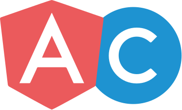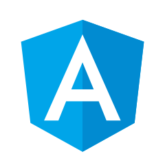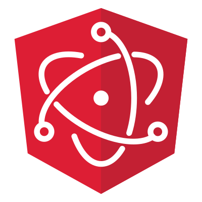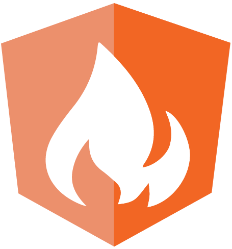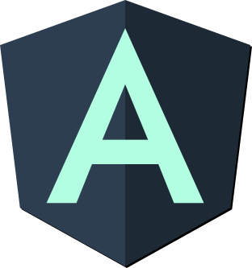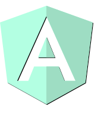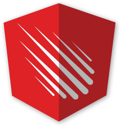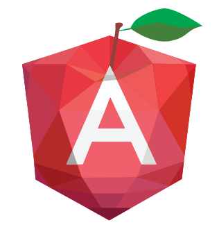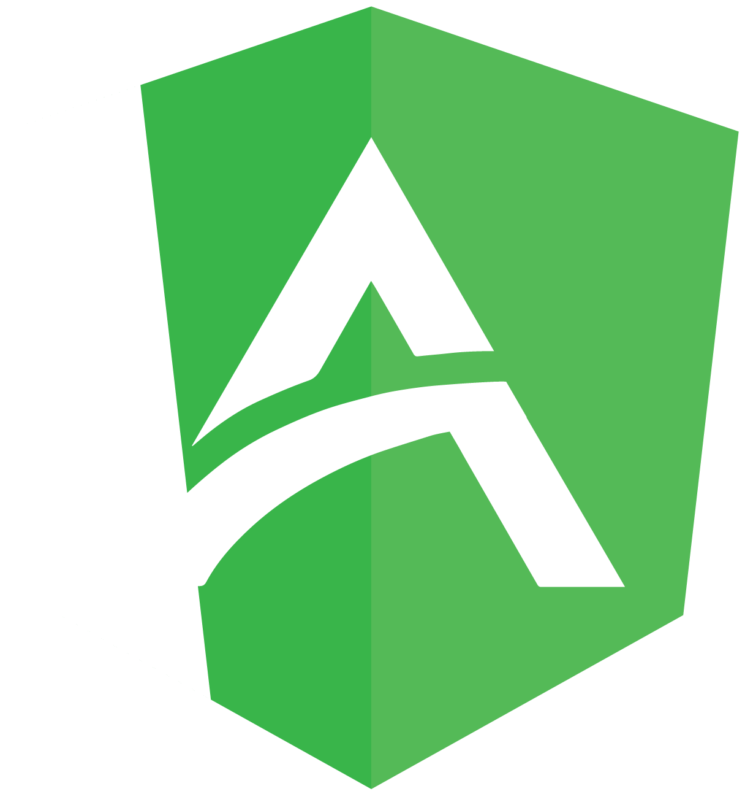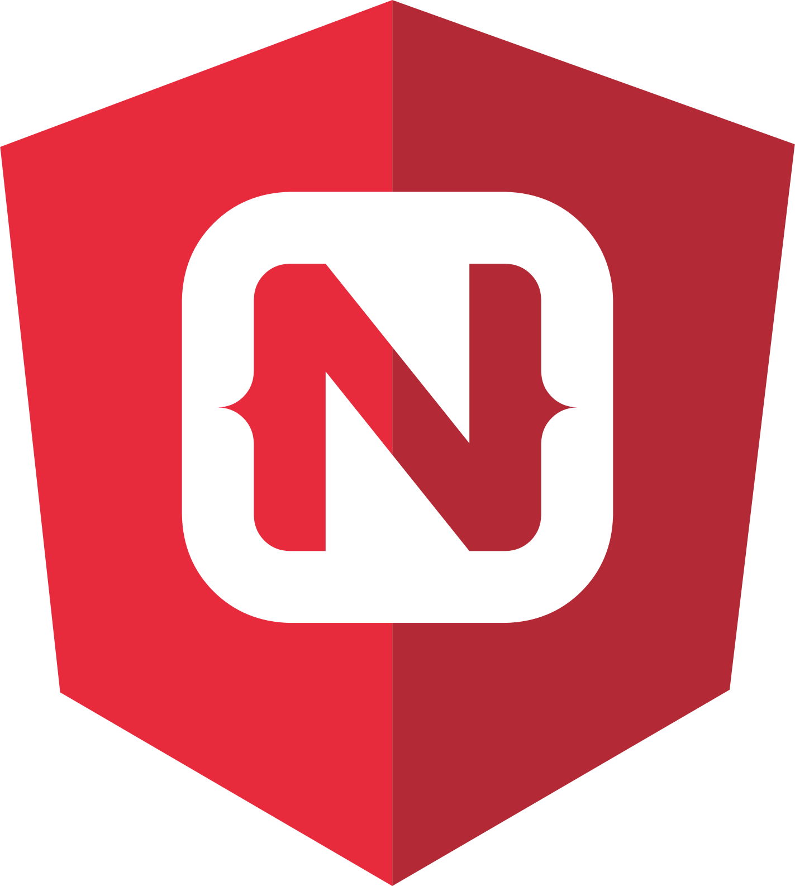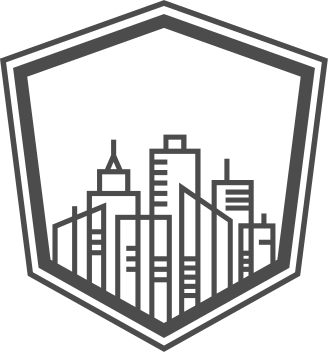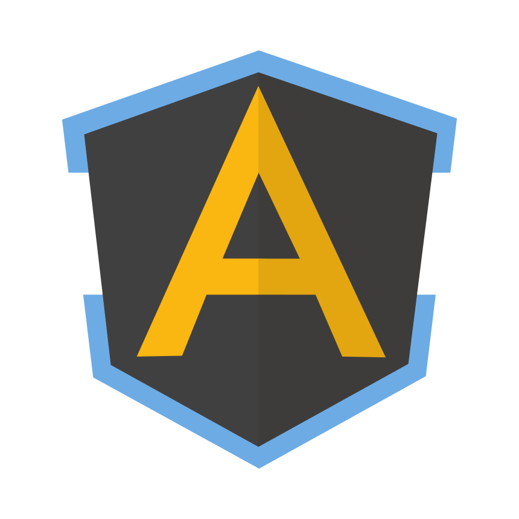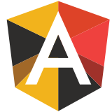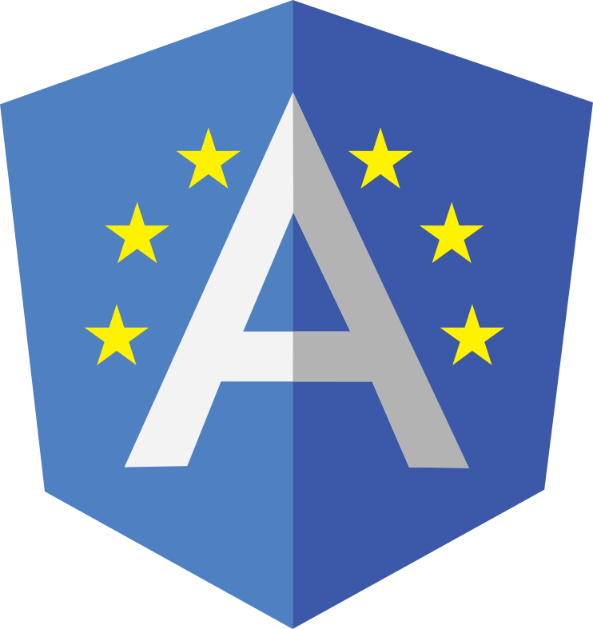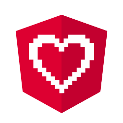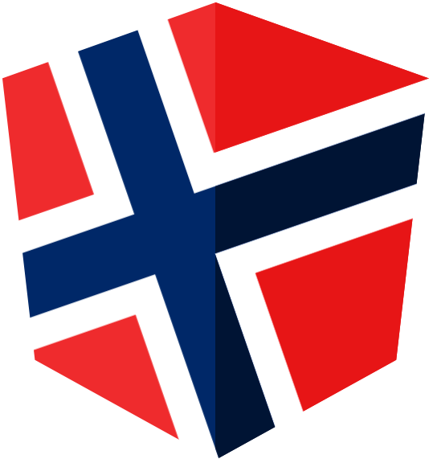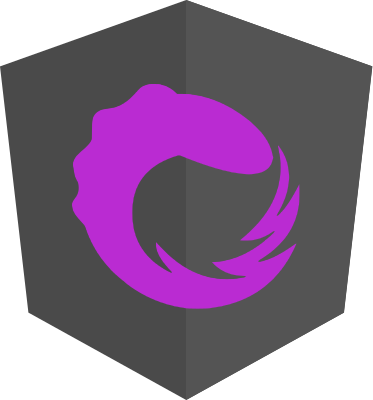
